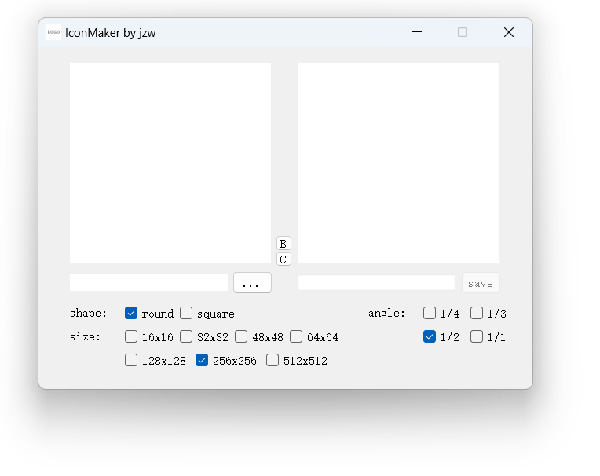
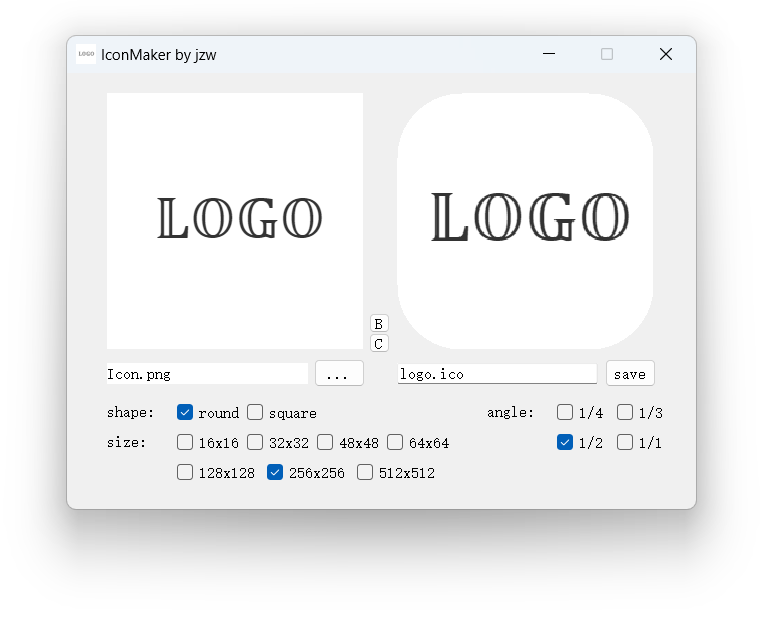

# IconMaker

图标制作器

+ 支持圆角/方角
+ 多种尺寸变换
+ 多种圆角选择
+ 图标背景切换测试

# 截图

主界面

图标转换

# 附录

C++ Qt5图标设置

1. 程序图标

添加`Qt Resource File`

修改`prefix`，`Add Files`添加图片

`setWindowIcon(QIcon("path to your logo file"));`

2. Release图标

添加`Empty File`:`logo.rc`

在其中写入：`IDI_ICON1 ICON DISCARDABLE "logo.ico"`

在`.pro`中添加：`RC_FILE += logo.rc`
